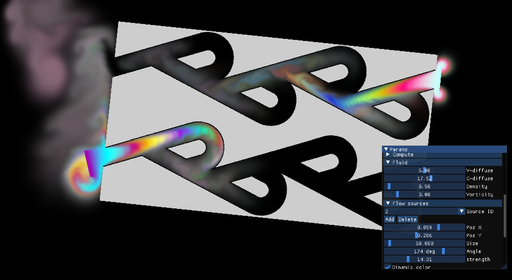

# Симулятор жидкости

Данная программа производит симуляцию потоков в вязкой среде на основе уравнения Навье-Стокса. Вычисления производятся на GPU c использованием технологии Cuda.

Возможности:
- Изменение размера рабочей области;
- Настройка временного шага;
- Изменение параметров среды (вязкости, плотности, дифузии)
- Отображение в режимах красителя/градиента давления/скорости;
- Возможность детальной настройки параметров вычислений;
- Режим быстрых вычислений;
- Добавление настраиваемых источников течения и непроницаемых объектов из png-файлов.

